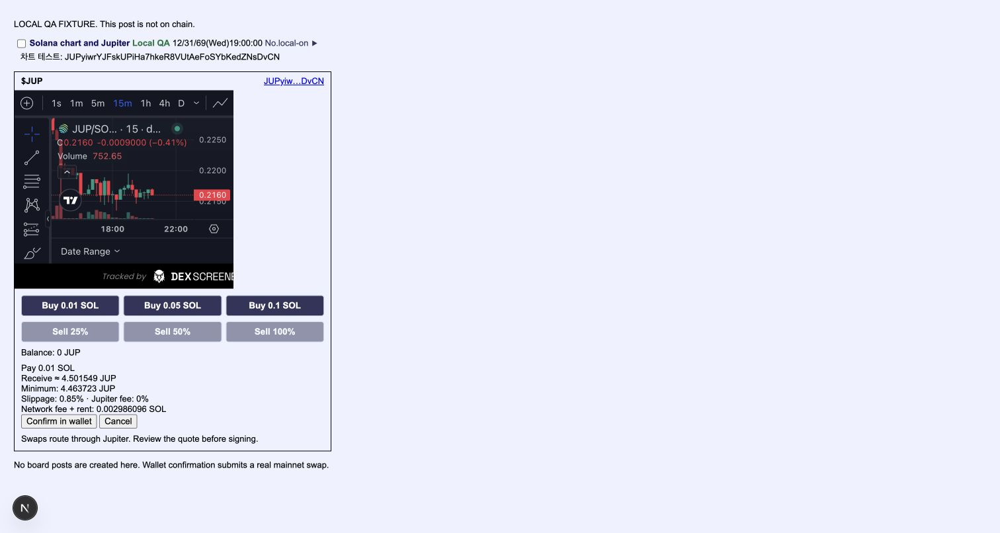
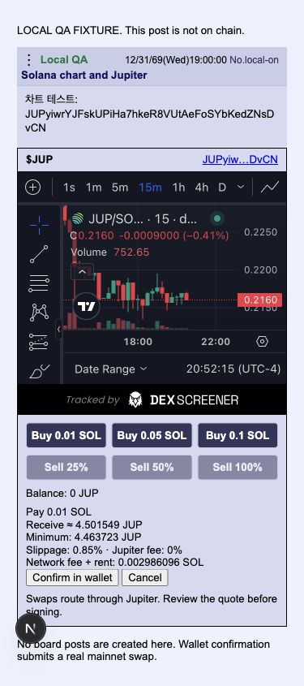

# Solana Tranches validation

Local QA on September 15, 2026 (America/New_York). Screenshots show a clearly labeled local post fixture using the real components, live DexScreener chart, live Jupiter quote and connected wallet. The fixture is not included in the application routes or published to a board.

- 45 tests, 350 assertions passed. Coverage includes indexed-token filtering, pool selection, Solana/Robinhood navigation, invalid quote responses, transaction-message preservation, expired quotes, rejected signatures, wallet changes during requests, and precise percentage sells above JavaScript's safe integer range.
- TypeScript, the production server build, and both Solana and Robinhood static exports pass.
- Native controls use Jupiter Swap API v2, not the Jupiter UI plugin. No new dependencies or external scripts.
- A 0.01 SOL to JUP unsigned transaction from Jupiter simulated successfully on mainnet (151,321 CU). No swap was signed or submitted. The simulation is not evidence of settled buy/sell trades.
- Browser QA verified live quotes, zero-balance sell disabling, quote cancellation, chart rendering and mobile layout. DexScreener sometimes took a long time to load.

## Empty board

The existing Create Board flow created the ungated `tranches` table. This is the only live write. No test posts or replies were published.

- Table: `5KHWatsUBJDDvQ6ANCyGsEbEB3L4TtyKfg6oZUEpoyQ4`
- [Finalized creation](https://solscan.io/tx/3VuvoP7XcN2ErZV9u3CJJwDSUAvgCrZPhLLc3CkFSyhyuRq7fGCkinPurGBGrKawLPiXfYK5CA9YxUroCJBKroNB)
- The board page reads successfully and shows no threads.

## Deployment requirements and limits

A functioning `NEXT_PUBLIC_RPC_ENDPOINT` supporting token-account queries is required. The repository's configured RPC returned 403 during local QA. PublicNode supported board creation but rejected indexed token-account requests. Quote/balance QA therefore used a local read-only proxy to Solana's public mainnet RPC; this proxy is not part of the application or deployment.

Jupiter's documented keyless API access is rate limited. Quotes are requested only on an explicit button click; HTTP 429 produces a retry message. Production traffic may require a separately configured authenticated API service. No API key is embedded by this change.

Actual wallet-signed buy/sell settlement, a deployed-site smoke test, and production RPC/API capacity remain unverified. Do not interpret mocked execution tests or unsigned simulation as proof of those paths.

## Screenshots

## References

- [Jupiter Order and Execute](https://developers.jup.ag/docs/swap/order-and-execute)
- [Jupiter rate limits](https://developers.jup.ag/docs/portal/rate-limits)
- [DexScreener API](https://docs.dexscreener.com/api/reference)
