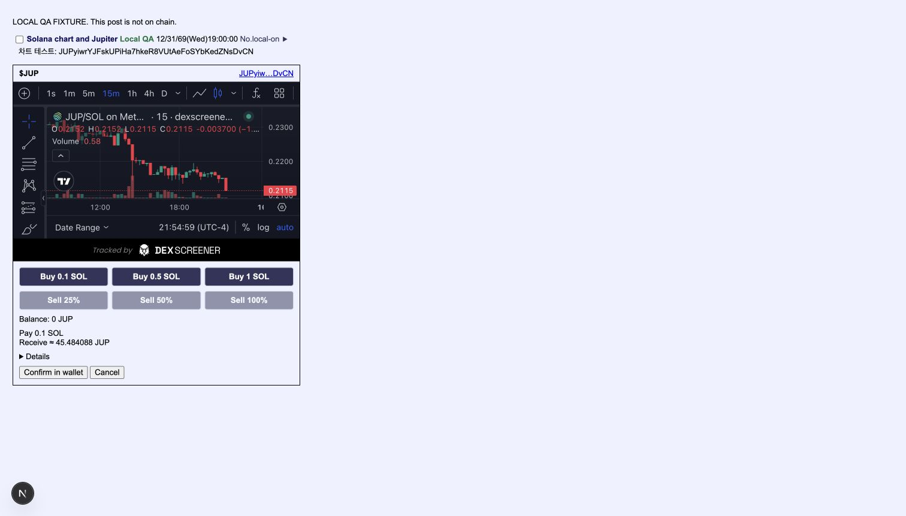
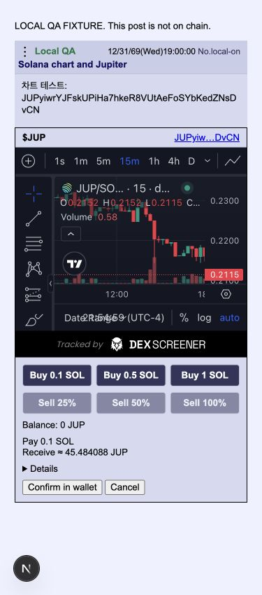
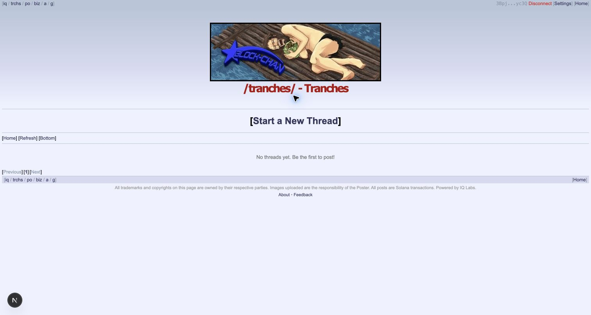

# Solana Tranches validation

Local QA on September 15, 2026 (America/New_York). Screenshots show a clearly labeled local post fixture using the real components, live DexScreener chart, live Jupiter quote and connected wallet. The fixture is not included in the application routes or published to a board.

- 46 tests, 368 assertions passed. Coverage includes indexed-token filtering, pool selection, Solana/Robinhood navigation, invalid quote responses, transaction-message preservation, expired quotes, rejected signatures, wallet changes during requests, and precise percentage sells above JavaScript's safe integer range.
- TypeScript, the production server build, and both Solana and Robinhood static exports pass on the final implementation. Builds ran from an isolated source copy with no local QA routes.
- Native controls use Jupiter Swap API v2, not the Jupiter UI plugin. No new dependencies or external scripts.
- A 0.01 SOL to JUP unsigned transaction from Jupiter simulated successfully on mainnet (151,321 CU). No swap was signed or submitted. The simulation is not evidence of settled buy/sell trades.
- Browser QA verified live quotes, zero-balance sell disabling, quote cancellation, chart rendering and mobile layout. DexScreener sometimes took a long time to load.

## Empty board

The existing Create Board flow created the ungated `tranches` table. This is the only live write. No test posts or replies were published.

- Table: `5KHWatsUBJDDvQ6ANCyGsEbEB3L4TtyKfg6oZUEpoyQ4`
- [Finalized creation](https://solscan.io/tx/3VuvoP7XcN2ErZV9u3CJJwDSUAvgCrZPhLLc3CkFSyhyuRq7fGCkinPurGBGrKawLPiXfYK5CA9YxUroCJBKroNB)
- The board page reads successfully and shows no threads.

## Deployment requirements and limits

A functioning `NEXT_PUBLIC_RPC_ENDPOINT` supporting token-account queries is required. The repository's configured RPC returned 403 during local QA. PublicNode supported board creation but rejected indexed token-account requests. Quote/balance QA therefore used a local read-only proxy to Solana's public mainnet RPC; this proxy is not part of the application or deployment.

Jupiter's documented keyless API access is rate limited. A preset click starts quotes, which refresh every 30 seconds while open and visible; HTTP 429 produces a retry message. Production traffic may require a separately configured authenticated API service. No API key is embedded by this change.

Actual wallet-signed buy/sell settlement, a deployed-site smoke test, and production RPC/API capacity remain unverified. Do not interpret mocked execution tests or unsigned simulation as proof of those paths.

## Optional referral fee

Leave `NEXT_PUBLIC_JUPITER_REFERRAL_ACCOUNT` unset until the maintainer creates a Jupiter Swap referral account and the required fee-token accounts. This setting is a referral account address, not a wallet. Verify its on-chain partner is `C3EPAsjHq6DHLDzG2bXySFpUYmQ5AUqDXDfEiEsCekrH`, its project is `DkiqsTrw1u1bYFumumC7sCG2S8K25qc2vemJFHyW2wJc`, and the partner share is 80% before configuring and rebuilding the app.

When enabled, orders request 125 basis points total: 1% to the partner and 0.25% to Jupiter, subject to token rounding. The response must match both the configured referral account and exactly 125 bps. Missing-fee fallback, unexpected charges and mismatched recipients are rejected before signing. No referral accounts have been created or funded by this change; collection remains unverified.

The compact quote keeps Pay and Receive visible, plus the actual total fee when nonzero. Minimum received, slippage and network costs are under Details. Buy presets are 0.1, 0.5 and 1 SOL.

## Final refresh and mobile evidence

The live browser issued two order requests 30.34 seconds apart without a second preset click; no execute request was made. The quote stays visible during refresh and confirmation is disabled until the replacement arrives. Cancellation invalidates an in-flight refresh. Regression tests cover timed refresh, stale confirmation, rejected signatures, wallet changes and cancelling a pending refresh.

Captured from the current implementation at commit `ea152ed`. These replace the earlier quote screenshots. Quote prices are live snapshots, not fixed expected values.

[Observed order requests](live-refresh.json)

## References

- [Jupiter Order and Execute](https://developers.jup.ag/docs/swap/order-and-execute)
- [Jupiter rate limits](https://developers.jup.ag/docs/portal/rate-limits)
- [DexScreener API](https://docs.dexscreener.com/api/reference)

Quote refresh update: an open quote refreshes after 30 seconds while the tab is visible, or on return to the tab. Cancellation, wallet changes and unmount clear the refresh timer. A stale confirmation requests a new quote without signing; wallet approval still requires a separate click. Focused regression coverage verifies timed refresh makes no signing or execution calls.
