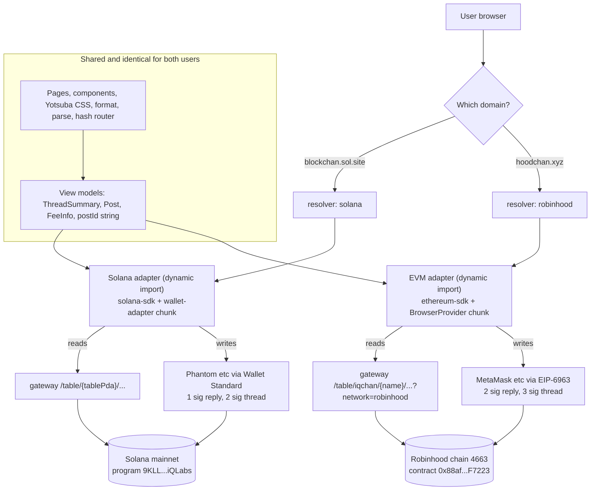
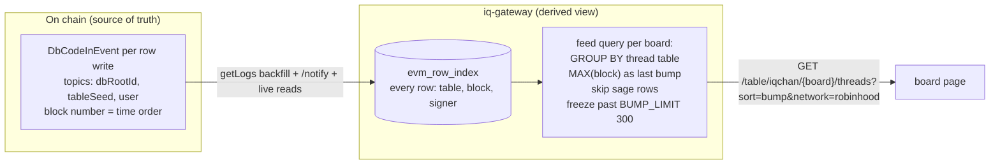
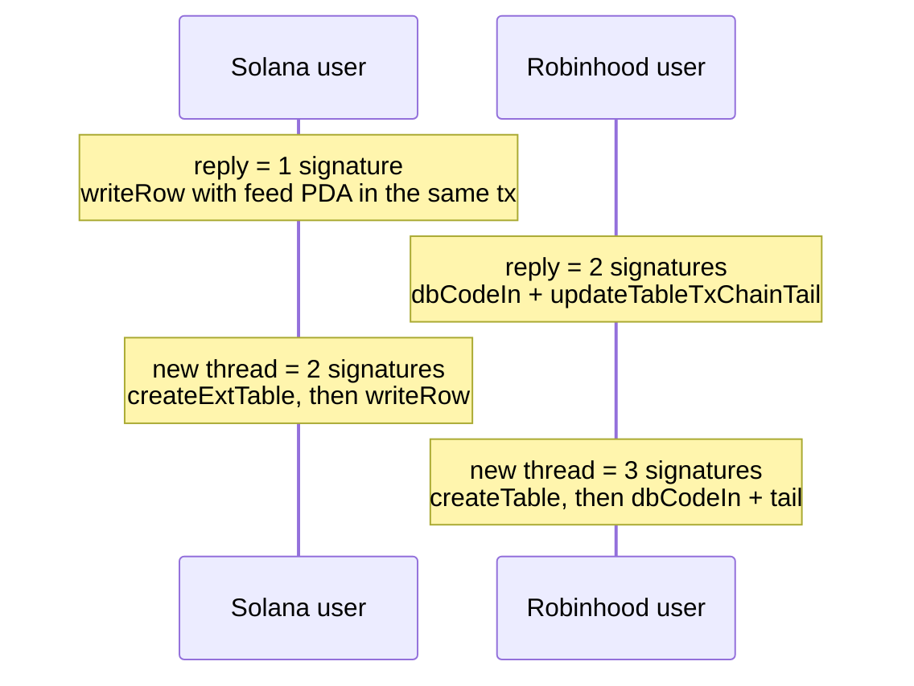

# EVM Multichain Plan: Robinhood Chain Support

Status: approved, ready to implement.
Scope: one codebase, one build, one container. Solana keeps working exactly as today. Robinhood Chain (chain id 4663) is added behind a chain adapter layer. Monad comes later by reusing the same EVM adapter with a different network entry.

Related work already shipped:

- iq-gateway serves solana, sepolia, monad, monadTestnet, robinhood in one multi-chain process.
- iq-gateway has a durable EVM row index in SQLite (`evm_row_index`, `evm_index_state`) fed by live reads, `/notify`, and `eth_getLogs(DbCodeInEvent)` backfill.
- `@iqlabs-official/ethereum-sdk` 0.3.0 ships the `robinhood` network mode. Contract `0x88af59e58C7E5DcbE7cc12972B90cff3fEEF7223` is live and verified on Robinhood mainnet.

## 1. Where a Solana user and a Robinhood user diverge

The two users run the same bundle. Divergence starts at DNS and ends at the adapter boundary. Nothing above the adapter knows which chain it is on.



Divergence points, top to bottom:

| Layer | Solana user | Robinhood user | Decided by |
|---|---|---|---|
| Domain | blockchan.sol.site | hoodchan.xyz | DNS + Caddy (same container) |
| Network resolver | `solana` | `robinhood` | `NEXT_PUBLIC_NETWORK` env override, else hostname map, else `solana` |
| Adapter chunk | `chains/solana/` | `chains/evm/` | dynamic import, wallet libs never cross-load |
| Wallet | Wallet Standard injected wallets | EIP-6963 injected wallets, ethers v6 `BrowserProvider.getSigner()` | adapter |
| Table addressing | derived table PDA (base58) | `("iqchan", tableName)` string pair | adapter URL builder |
| Post identity | `__txSignature` (base58) | `__txHash` (0x hex) | adapter, exposed upward only as `postId: string` |
| Gateway calls | `/table/{tablePda}/rows` etc | `/table/iqchan/{tableName}/rows?network=robinhood` etc | adapter URL builder |
| Explorer, currency copy, fee notice | Solscan, SOL | Blockscout, ETH | `NetworkTheme` |
| Logo, banners, accent colors | `public/themes/solana/` | `public/themes/robinhood/` | `NetworkTheme` |
| localStorage | blockchan.sol.site origin | hoodchan.xyz origin | isolated for free by separate origins |

Hard rules that keep the upper layers shared:

1. `@solana/web3.js`, `ethers`, `iqlabs-sdk`, `@iqlabs-official/ethereum-sdk`, `@solana/wallet-adapter-*` may only be imported under `src/lib/chains/`.
2. No chain primitive types (PublicKey, TableRef, PDA) above the adapter boundary. View models carry plain strings.
3. An `if (chain)` branch appearing in a component means the adapter interface is missing a method or a theme field. Extend the interface instead.

## 2. Folder structure, before and after

Before (chain code spread across the app):

```
src/
├── app/providers.tsx            Solana ConnectionProvider + WalletProvider hardcoded
├── hooks/use-post.ts            all writes, Solana only, 350 lines
├── hooks/use-threads.ts         feed PDA fetch + client-side grouping
├── hooks/use-paginated-replies.ts
├── hooks/use-board-gate.ts
├── components/wallet-button.tsx wallet-adapter specific
├── lib/config.ts                RPC + gateway URLs, Solana only
├── lib/constants.ts             PDA derivation + BOARD_COLUMNS + BUMP_LIMIT mixed
├── lib/board.ts                 hand-rolled feed PDA + thread assembly
└── lib/gateway.ts               fetchers with /table/{pda} paths baked in
```

After:

```
src/
├── lib/chains/
│   ├── types.ts                 ChainAdapter interface, NetworkTheme, view models
│   ├── resolve.ts               env override -> hostname map -> solana
│   ├── index.ts                 loads the active adapter via dynamic import
│   ├── solana/
│   │   ├── adapter.ts           moved: PDA derivation, feed PDA, gateway URLs, writes
│   │   └── wallet.tsx           moved: providers.tsx + wallet-button internals
│   └── evm/
│       ├── adapter.ts           new: ethereum-sdk writes, (dbRootId, tableName) URLs
│       └── wallet.tsx           new: EIP-6963 discovery + BrowserProvider signer
├── lib/theme.ts                 NetworkTheme lookup for the resolved network
├── lib/constants.ts             chain-free only: BOARD_COLUMNS, BUMP_LIMIT, board metadata
├── lib/gateway.ts               thin fetch helpers, paths supplied by adapter
├── hooks/use-post.ts            thin: calls adapter.createThread / adapter.postReply
├── hooks/use-threads.ts         thin: calls adapter.listThreads
└── public/themes/
    ├── solana/                  existing logo + randombanners move here
    └── robinhood/               new assets (logo, banners, background)
```

`ChainAdapter` surface (domain operations, not chain primitives):

```ts
interface ChainAdapter {
  network: NetworkId;
  theme: NetworkTheme;
  listThreads(boardId, opts): Promise<ThreadSummary[]>;
  readThread(boardId, threadId, opts): Promise<{ op: Post; replies: Post[] }>;
  checkGate(boardId, wallet): Promise<GateResult>;
  createThread(boardId, draft, onStep): Promise<{ threadId; postId }>;
  postReply(boardId, threadId, draft, onStep): Promise<{ postId }>;
  createBoard(boardId, meta, onStep): Promise<void>;
  explorerTxUrl(postId): string;
  formatPostId(postId): string;
  useWallet(): ChainWallet;   // address, connect, disconnect, signerReady
}
```

`onStep(k, n, label)` drives the posting overlay, which changes from a fixed "sign 1/2" to a variable step list.

## 3. Data model on Robinhood

Same dbRootId, fresh and independent on the EVM chain:

```
DbRoot "iqchan" (on Robinhood, created once by setup script)
├── board table, name "biz"              rows: OP posts only
├── thread table, name "biz/thread/{uuid}"   rows: replies only
└── (no feed object on chain, see section 4)
```

- Row shapes are the Solana shapes with `threadPda` renamed to `threadName`.
- Tables are created with the shared `BOARD_COLUMNS`, `idCol = "time"`.
- Tail pointers (`updateTableTxChainTail`) are always maintained. Every table stays fully enumerable with the pure ethereum-sdk pointer walk. No gateway lock-in.
- Edit and delete (`manageRowData`) are out of scope for v1 on EVM, matching the current Solana UI which never wired them.
- Images stay URLs pasted into the `img` field, same as Solana today. No on-chain image blobs (linkedListFee makes them expensive).

## 4. The one real SVM vs EVM difference: the feed

On Solana the bump order is recorded at write time: the reply instruction includes the board feed PDA as an extra account, so one signature covers both the row and the bump. The EVM contract has no equivalent of remainingAccounts, and a second table write would mean a second transaction and a second wallet popup.

Decision: do not double-write. The board feed on EVM is a derived view computed by the gateway from the on-chain write history.



Why this is safe:

- The raw facts (which thread received a row, in which block, by whom) are all on chain in `DbCodeInEvent`. The gateway only materializes an ordering that anyone can recompute with standard `eth_getLogs`. It is a cache of a public derivation, not private state.
- A pure-SDK reader without any gateway still enumerates every board and every thread through the maintained tail pointers. The only degradation is thread ordering (creation order instead of bump order).
- `sage` becomes a flag inside the reply row JSON. The feed rule ignores sage rows when computing last bump. `BUMP_LIMIT = 300` is enforced by the same rule.

Write cost and signature comparison:



Protocol fees on Robinhood at current on-chain defaults: reply about 0.00012 ETH, new thread about 0.00048 ETH (tableCreation 0.00036 + basic 0.00012). Fees are read live from the contract, never hardcoded.

Known contract-level limits, accepted for v1 and deferred to a contract v2 cycle together: the two-tx write pattern (an EVM transaction cannot see its own hash, so the tail update must be a second tx) and the concurrent-writer orphaning race on hot tables. The gateway log index already repairs reads for both.

## 5. Gateway work item

One new endpoint on the EVM table router:

```
GET /table/:dbRootId/:boardName/threads?sort=bump&limit=&network=
```

Backed by the SQL sketch in section 4 over `evm_row_index`. Respects sage and BUMP_LIMIT. Everything else needed already exists (rows, thread, meta, notify, subscribe, gate, dbroot all take `?network=robinhood` today).

## 6. Implementation order

1. Adapter extraction, behavior frozen. Move Solana code into `chains/solana/` behind the interface. Ship only after the live Solana site is verified unchanged. No EVM code in this step.
2. Resolver and theme module. Hostname map, CSS custom properties for accent colors, theme asset folders. Still Solana-only, zero user-visible change.
3. Gateway threads endpoint (section 5).
4. EVM adapter, developed and tested end to end against monadTestnet (free faucet MON, identical code path). Robinhood has no testnet, so monadTestnet is the rehearsal chain.
5. Robinhood bootstrap: port setup-boards to ethereum-sdk (`scripts/setup-boards-evm.ts`), run initializeDbRoot + createTable for launch boards on Robinhood mainnet, register the dbroot in the gateway `known-dbroots.json`, end to end smoke test.
6. Deploy: DNS for hoodchan.xyz, Caddy site block to the same container, `NEXT_PUBLIC_NETWORK` stays unset (hostname decides).
7. Branding pass: real logo, banners, palette for hoodchan (decided together, placeholder accent until then).

## 7. Open items

- Launch board list for hoodchan (mirror biz/po/a/g or Robinhood-native boards).
- hoodchan logo, banner set, accent palette.
- Contract v2 cycle (single-call write, orphaning fix, optional two-table write) tracked separately.
